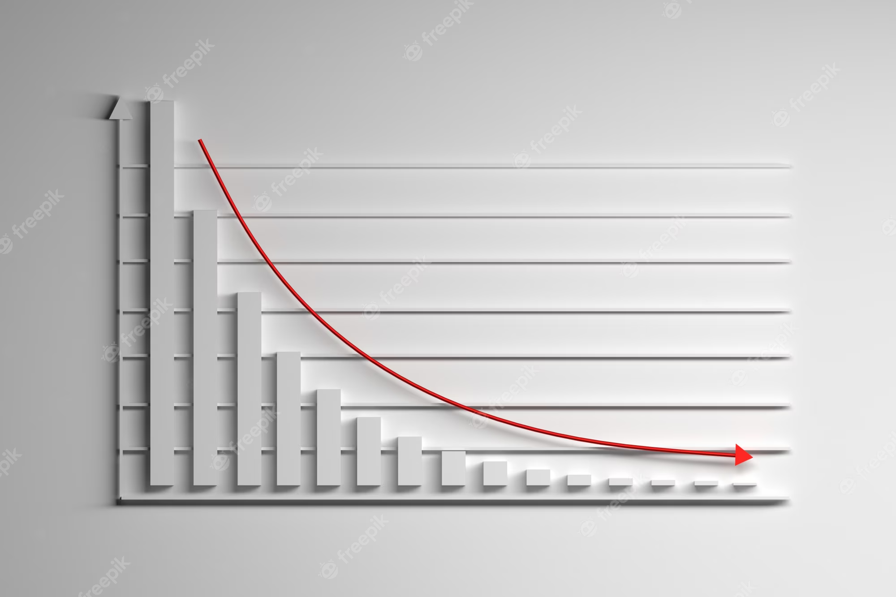
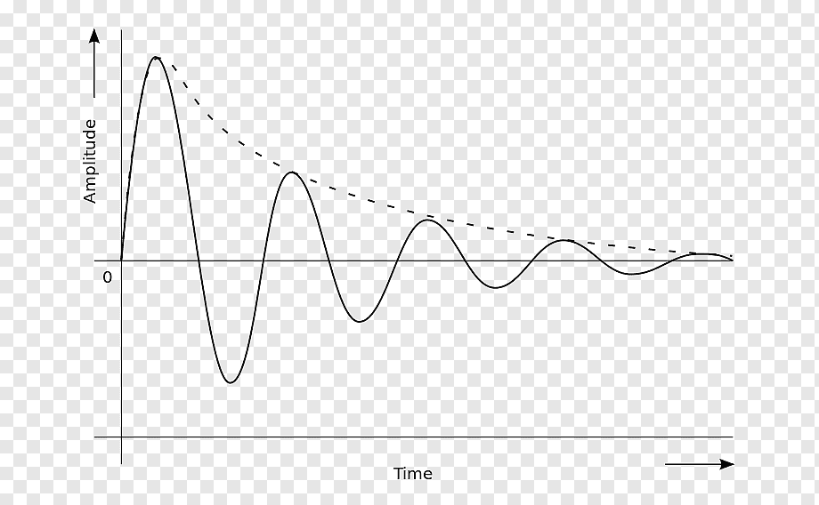
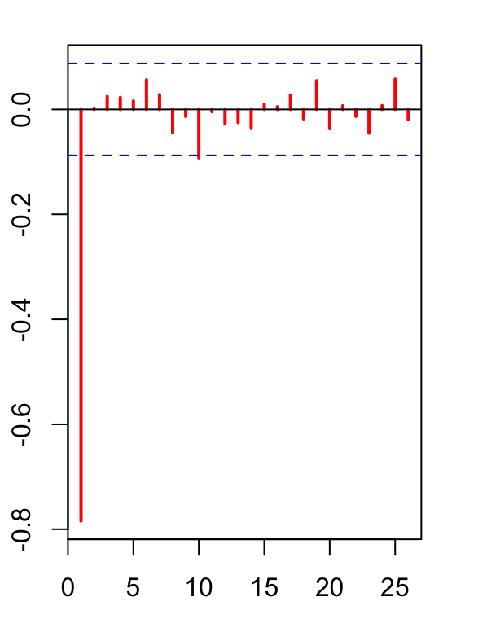

# Estacionariedade

```{r message=FALSE, include=FALSE}
# Carregando pacotes
#these libraries are necessary
library(readxl)    # Leitura de arquivos txt csv
library(httr)      # Para usar o comando GET
library(knitr)
library(utils)     # Pacote R.utils
library(dplyr)     # Serve para transformar dados
library(ggplot2)   # The Grammar os Graphics ou GGPLOT, para fazer gráficos
library(raster)    # Manipulação de dados
library(modelr)    # Modelar funções e utilizar o pipe
library(broom)     # Extração das estatísticas de ajuste do modelo
library(lubridate) # Modela dados do tipo data
library(textreg)   # Pacote para fazer tabelas das saidas de modelos
library(astsa)     # Applied Statistical Time Series Analysis
library(stats)     # The R Stats Package
library(forecast)  # Trabalhar com modelos ARIMA
library(lmtest)    # Teste de Hipóteses
library(ppcor)     # Partial correlation
library(emo)       # Colocar emoji
library(urca)      # Testes Unit Roots -
library(timeSeries)
library(nortest)
#No ppcor o comando é ppcor(cbbind(vetor1,vetor2,...))
library(fpp2)
library(foreign)
library(dynlm)
library(car)
library(lmtest)
library(sandwich)
library(tseries) 
library(lattice)
(library(Quandl))
(library(dygraphs))
(library(magrittr))
(library(PerformanceAnalytics))
(library(quantmod))
(library(zoo))
(library(DT))
(library(magrittr))
(library(highcharter))
(library(PerformanceAnalytics)) 
(library(htmltools))
```
## Introdução
  
A série temporal tipicamente faz a relação de uma entidade em vários períodos de tempo. Por exemplo, temos a serie temporal 
AirPassengers (embutida no proprio R) que nos mostra o total mensal de passageiros de voos comerciais dos EUA durante 1946-1960

```{r}
data(AirPassengers)
AP <- AirPassengers
plot(AP)
```

Em geral, as primeiras análises procuram observar padrões no tempo, como a tendência de crescimento ou decrescimento, ciclos de altas(baixas), ou sazonalidade (padrões repetitivos no curto prazo) e eventuais irregularidades.
Seja uma relação de séries temporais $y$ e $x_k$:

$${y_t} = {b_0} + {b_1}{x_{1t}} +  \ldots  + {b_k}{x_{kt}} + {u_t}$$

As séries temporais possuem uma ordenação explícita no tempo. As relações podem ser contemporâneas (mesmo tempo t) ou dinâmicas (tempos distintos):

${y_t} = {b_0} + {b_1}{x_{1t}} +  \ldots  + {b_k}{x_{kt}} + {u_t}$ contemporâneas


${y_t} = {a_0} + {d_0}{z_t} + {d_1}{z_{t - 1}} + {d_2}{z_{t - 2}} + {u_t}$ dinâmicas ou defasadas

O exemplo anterior é típico de defasagem distribuída de ordem 2. O processo genérico poderia ser de q defasagens de z, ou ordem  q , dado por:

${y_t} = {a_0} + {d_0}{z_t} + {d_1}{z_{t - 1}} +  \ldots  + {d_q}{z_{t - q}} + {u_t}$

### Passeio Aleatório (*Random Walk*)

O passeio ou caminho aleatório é um processo $\{X_t\}$ tal que depende apenas de seus valores passados e de um processo puramente aleatório $\{ε_t\}$ com média $\mu$ e variância $σ^2_ε$  tal que:

* 	 $X_t = X_{t-1} + ε_t$		caminho aleatório sem intercepto

*    $X_t = \delta + X_{t-1} + ε_t$		caminho aleatório com intercepto

Substituindo a expressão de $X_{t-1}$ em $X_t$  tem-se $X_t = X_{t-2} + ε_{t-1} + ε_t$. Generalizando tem-se $X_t$ como função do valor inicial $X_0=0$.


#### Simulação de um passeio aleatório genérico

O passeio aleatório no R é feito numa simulação, neste caso, para uma função normal genérica.

```{r}
# SIMULANDO UM PASSEIO ALEATORIO GENERICO
# simulate random walk 
#
set.seed(321)
e = rnorm(250)
y.rw = cumsum(e)
ts.plot(y.rw, lwd=2, col="blue", main="Random Walk")
abline(h=0)
```

É possível verificar oscilações na série ao longo do tempo. A presença de eventuais tendências (se alterando ao longo de subamostras) e oscilações que indicam volatilidade ao longo das diferentes subamostras. Tais indicações, embora graficamente ainda representem apenas indicações, darão possíveis interpretações de não-estacionariedade da série.

#### Exemplo para a série do PIB Brasileiro

Neste exemplo utiliza-se a série n. 4380 do PIB mensal a valores correntes de 01/1990 até 04/2023

```{r}
PIB <- Quandl('BCB/4380')
head (PIB)
```

Aqui podemos ver que o data frame se inicia em 2023 e vai indo ate 1990, isso se tornara um problema para criarmos uma time-series no futuro, então vamos colocar ela de cabeça para baixo. Tambem vamos excluir a coluna Date, para não criar redundancia de datas na criação da TS.

```{r}
PIBc <- arrange (PIB, Value) #colocando em ordem crescente (cabeça pra baixo)
PIBcpb<- PIBc [,-c(1)] #excluindo a primeira coluna (Date)
head (PIBcpb)
```

AGORA SIM!

Vamos transforma-la em TS e puxar um gráfico

```{r}
PIB.ts <- ts(PIBcpb, start = 1990, frequency = 12)
dygraph(PIB.ts, main = "Produto Interno Bruto (PIB) mensal - valores correntes") %>% dyRangeSelector()
```

Agora vamos a estacionariedade do PIB

```{r}
dpib<-diff(PIB.ts,1)
ddpib<-diff(PIB.ts,2)
plot(ddpib,main="Séries de Diferenças do PIB",type = "o",col="black",lwd=2,lty=1, ylab = "Indice",xlab="")
lines(dpib,type="o",col = "red",lwd=2,lty=2)
legend("bottomleft",c("d(PIB,2)", "d(PIB)"),
       cex=0.7,lwd=2,lty=1:2,col=c(1,2))
```

### Ruído Branco (*White noise*)

Assume-se em geral que os resíduos ut  sejam bem comportados, ou seja, Ruído Branco: série de resíduos que representa um processo gaussiano, ou seja, com distribuição normal, média zero, variância constante e não-autocorrelacionados. O conceito de ruído branco será importante para compreender o conceito de estacionariedade de séries temporais.

$$ 	
{u_t} \sim N(0,{\sigma ^2})
$$

#### Simulação de um processo Gaussiano White Noise 

Utilizando o R/RStudio para gerar um White noise, pelo script. O resultado será como na Figura.

```{r}
options(digits=4, width=70)
# simulate Gaussian White Noise process
set.seed(123)
y = rnorm(250)
ts.plot(y,main="Processo Gaussiano White Noise",
        xlab="time",ylab="y(t)",col="blue", lwd=2)
abline(h=0)

# plot equivalente usando a função plot()
plot(y, main="Processo Gaussiano White Noise", type="l",
     xlab="time",ylab="y(t)", col="blue", lwd=2)
abline(h=0)
```

### Tendência determinística

Outro conceito é o de tendência (trend), que reflete as oscilações de longo prazo em uma série. No script e Figura, tem-se uma simulação de um processo de tendência determinística.

#### Simulação de um processo com tendência determinística

```{r}
# SIMULANDO UMA TENDENCIA DETERMINÍSTICA
# 
set.seed(123)
e = rnorm(250)
y.dt = 0.2*seq(1,250) + e
ts.plot(y.dt, lwd=2, col="blue", main="Tendência Determinística + Ruído")
abline(a=0, b=0.2)
```

### Estacionariedade

Em geral, a econometria tradicional (causa e efeito) pressupõe que todas as séries sejam estacionárias. Seja a seguinte série temporal $X_t$:
	$$
	X_t = \mu + ε_t
	$$
	
Em que $ε_t$  é um ruído branco e $\mu$ é uma constante.
Tem-se uma série estacionária se o valor esperado da série $X_t$  for constante no tempo, ou seja,

$$
	E(X_t) = E(μ + ε_t ) = μ + E(ε_t ) = μ + 0 = μ
$$

O caso da série não estacionária, por exemplo, seria o caso de uma série com tendência:

*   $X_t = \alpha + βt + ε_t$ em  que t denota tempo;

*   $E(X_t) = E(\alpha + βt + ε_t) = E(\alpha + βt) + E(ε_t ) = μ + βt$  $\ne$ constante

Este é um caso de tendência estacionária, pois uma vez retirada a tendência da série, esta se tornaria estacionária.  Portanto, “*será uma série estacionária se os dois primeiros momentos (média e variância) forem independentes do tempo e a autocovariância for dependente apenas da janela temporal (j) entre os dados*”:

*   $E(X_t) =  μ$
*   $E\left[ {\left( {{X_t} - \mu } \right)\left( {{X_{t - j}} - \mu } \right)} \right] = \left\{ {\begin{array}
{{\sigma^2},\;para\;\left( {j = 0} \right)}\\
{0\;\;,\;para\;\left( {j \ne 0} \right)}
\end{array}} \right.$

Resumidamente, a série não-estacionária tem uma raiz unitária e representa um processo estocástico. Mas, para esclarecer, são precisos outros conceitos auxiliares antes de esclarecer o que é ter uma raiz unitária. A utilização de séries não-estacionárias poderá gerar regressões espúrias, que serão explicadas mais a frente.


### Operadores Diferença (difference) x Defasagem (lag)

Seja a série $X_t$  em nível. O operador diferença é definido como segue:

$$
∆X_t=X_t-X_{t-1}
$$

$$
∆^2 X_t=∆X_t-∆X_{t-1}=   
(X_t-X_{t-1})-(X_{t-1}-X_{t-2})= X_t-2X_{t-1}+X_{t-2}
$$

O operador de defasagem (L), ou *lag operator*, é definido como segue:

$$
LX_t=X_{t-1}
$$

$$
L^2 X_t=X_{t-2}
$$

e

$$
L^jX_t=X_{t-j}
$$

Propriedades de L:   

*   Se c é uma constante, então: $L^j c=c$

*   Propriedade distributiva: $(L^i+L^j)X_t=L^iX_t+L^jX_t=X_{t-i}-X_{t-j}$

*   Propriedade multiplicativa: $L^i(L^j)X_t=L^{i+j}X_t=X_{t-i-j}$

*   Se $|a|\gt 1: (1+a^{-1}L^{-1}+a^{-2}L^{-2}+a^{-3}L^{-3}+\ldots)X_t=\frac{-aLX_t}{(1-aL)}$

*   Se $|a|\lt 1: (1+aL+a^2L^2+a^3L^3+\ldots)X_t=\frac{X_t}{(1-aL)}$    


#### Operador defasagem (lag)

No R, pode-se obter a defasagem de uma série usando a função lag(x,y), em que x é a série e y é o número de períodos a defasar a série.


```{r}
# fazendo lag
tail (PIB.ts)
pib_3<- lag (PIB.ts, -3)
tail (pib_3)
```
```{r}
plot(tail(PIB.ts), type="o",col = "black",lwd=2,lty=1)
lines(tail(pib_3),type="o",col = "red",lwd=2,lty=2)
legend("topright",c("PIB", "PIB t-3"),lwd=2,lty=1:2,col=c(1,2))
data.lag<-cbind(PIB.ts,pib_3)
#View(data.lag)
```

#### Operador diferença (diff)

Já para fazer a diferença, faz-se, em R:  `diff(x, lag = 1, differences = 1)`.

```{r}
#View(consumo.ts)
pibd<-diff(PIB.ts,1)
pibd
plot(PIB.ts,type="o",col = "black",lwd=2,lty=1)
legend("topright",c("PIB"),lwd=2,lty=1,col=c(1))
plot(pibd,type="o",col = "red",lwd=2,lty=1)
legend("topright",c("Primeira Diferença PIB"),lwd=2,lty=1,col=c(2))
```


### Processo Estocástico

Pode-se definir o processo estocástico como “Aquele que não é determinístico, ou seja, refere-se a uma variável aleatória cujo valor futuro não pode ser previsto com certeza absoluta”. Ou seja, terá um termo de erro $ε$ (uma incerteza).
Exemplo: Y = 100A + 0,1B + ε.

Imagine a taxa de câmbio $R\$/US\$$ em cada instante de tempo t entre 17h e 18h neste dia seja *aleatório*.  Pode-se interpretar este fato como uma realização $Z_t(w)$ da variável aleatória $Z_t$, e observar $Z_t(w), 5\lt t\lt 6$. Para se fazer uma previsão às 18h acerca da taxa de câmbio $Z_19(w)$ às 19h, é razoável olhar a evolução total de $Z_t(w)$ entre  17h e 18h. O modelo matemático que descreve esta evolução é chamado de  **Processo Estocástico**.

Podemos definir o Processo Estocástico como “uma coleção de variáveis aleatórias ordenadas no tempo e definidas em um conjunto de pontos T, que pode ser contínuo ou discreto”.

Está-se tentando modelar o caráter aleatório do processo e não uma descrição do tipo causa-efeito como no modelo de regressão. O comportamento pode ser obtido a partir de uma distribuição de probabilidades, e será tanto melhor quanto mais fiel estiver esta distribuição em relação à distribuição verdadeira.

No passeio aleatório, como exemplo, um choque temporário no PIB não se dissipará depois de vários anos e, desta forma, o choque teria efeito de um choque permanente. Se ele se revertesse à tendência, então apenas retirando a tendência o problema estaria resolvido para o uso econométrico.

Da discussão anterior sobre o passeio aleatório, obteve-se $X_t$ como função do valor inicial $X_0=0$, tal que:
$$
X_t=X_0+\sum_{j=1}^t{ε_j}
$$

Fazendo o valor esperado e a variância de $X_t$ , tem-se a média e a variância dependentes do tempo:


$E(X_t)=\sum_{j=1}^t{E(ε_j)} =tμ$

$Var(X_t)=\sum_{j=1}^t{Var{(ε_j)}} =tσ_ε^2$

O comportamento futuro dos dados no processo estocástico serão descritos pela distribuição de probabilidade conjunta ($F$):

$F(X_1,\ldots,X_t )=P(X_1 \le a_1,\ldots,X_t \le a_t)$
 
Em que P denota a probabilidade.

Isto posto, pode-se definir a estacionariedade de modo mais explícito, como Estacionariedade Forte. O processo será estacionário forte:   

a.   de primeira ordem se: $F(X_{t_1})=F(X_{t_1+k})$

b.   de segunda ordem se: $F(X_{t_1},X_{t_2})=F(X_{t_1+k},X_{t_2+k})$

c.   de ordem n se: $F(X_{t_1},\ldots,X_{t_n})=F(X_{t_1+k},\ldots,X_{t_n+k})$

A Estacionariedade fraca de ordem n pode ser definida quando:

*   A média e a variância do processo são constantes no tempo; e,

*   A estrutura de dependência linear depende apenas da distância entre os períodos e diminui com esta distância.
Portanto, tem-se Estacionariedade fraca para:

\[ E(X_t) = μ  = constante \]

\[ Var(X_t) = \sigma^2  = constante  \]

\[ Corr(X_t,X_{t-k}) = \rho(k) \]


# Função de Autocorrelação e Função de Autocorrelação Parcial

A série temporal dos retornos de um ativo denotada por $\left\{r_{t}\right\}_{t=1}^{T}$ é uma coleção de variáveis aleatórias coletadas ao longo do tempo (definição de processo estocástico). A modelagem econométrica de séries temporais univariadas tem como objetivo **capturar a relação linear entre** $r_{t}$ **e informações disponíveis antes de** $t$. 

Desta forma, os valores históricos de $r_{t}$ podem ser úteis para modelar o seu comportamento ao longo do tempo. Neste caso, a **correlação entre os retornos** tem um papel importante. Chamamos tais correlações de **autocorrelação** e esta é uma ferramenta básica para estudar uma série temporal estacionária.  

Neste sentido, este material tem como objetivo contribuir para o entendimento sobre **correlação, autocorrelação e autocorrelação parcial**.

## Correlação

O coeficiente de correlação de Pearson que mede a **dependência linear** entre duas variáveis é definido como:

$$
{\rho}_{x,y}=\frac{COV\left(x,y \right)}{\sqrt{Var\left(x \right),Var\left(y \right)}} =\frac{E\left[\left(x-{\mu}_{x} \right) \left(y-{\mu}_{y} \right)  \right]}{\sqrt{E{\left(x-{\mu}_{x} \right)}^{2}E{\left(y-{\mu}_{y} \right)}^{2}}} 
$$

onde ${\mu}_{x}$ e ${\mu}_{y}$ são a média de $x$ e $y$, respectivamente. Algumas propriedades:

* $-1\leq {\rho}_{x,y} \leq 1$
* ${\rho}_{x,y}={\rho}_{y,x}$
* ${\rho}_{x,y}=0$ quando as duas variáveis não são correlacionada

Existem outras alternativas para o cálculo de correlação proposto por Pearson. Dentre eles temos o $\rho$ de Spearman e o $\tau$ de Kendall. 

Quando uma amostra $\left\{(x_{t},y_{t})|t=1,...,T\right\}$ é coletada, a correlação pode ser obtida por seu estimador amostral:

$$
{\hat{\rho}}_{x,y}=\frac{\sum_{t=1}^{T}{ \left({x}_{t}-\overline{x} \right) \left({y}_{t}-\overline{y}  \right)}}{ \sqrt{\sum_{t=1}^{T}{{\left({x}_{t}-\overline{x}  \right)}^{2}\sum _{t=1}^{T}{{\left({y}_{t}-\overline{y}  \right) }^{2}}}}}
$$

onde $\overline{x}={\sum_{t=1}^{T}{{x}_{t}}}/{T}$ e $\overline{y}={\sum_{t=1}^{T}{{y}_{t}}}/{T}$ correspondem à média amostral de $x$ e $y$, respectivamente. No gráfico abaixo, mostramos exemplos de variáveis correlacionadas (positiva e negativa).

```{r}
data(mtcars)

x = sample(1:20,20)+rnorm(10,sd=2)
y = x+rnorm(10,sd=3)
z = (sample(1:20,20)/2)+rnorm(20,sd=5)
df = data.frame(x,y,z)

c1 = hchart(df, "scatter", hcaes(x = x, y = y), color = "black") %>%  
      hc_exporting(enabled = TRUE) 

c2 = hchart(mtcars, "scatter", hcaes(x = wt, y = mpg), color = "red") %>%
      hc_exporting(enabled = TRUE) 
lst = list(c1,c2)

hw_grid(lst, rowheight = 300)  %>% browsable()
```


## Função de Autocorrelação

A função de autocorrelação é o gráfico da autocorrelação contra a defasagem. Considere uma série temporal de retornos de uma ação $\left\{r_{t}\right\}_{t=1}^{T}$. O coeficiente de correlação entre $r_{t}$ e $r_{t-k}$ é chamado de autocorrelação de k-ésima ordem e é denotadado por:

$$
{\rho}_{k}=\frac {Cov\left({r}_{t},{r}_{t-k} \right)}{\sqrt{Var\left({r}_{t},{r}_{t-k} \right)}} =\frac{Cov\left({r}_{t},{r}_{t-k} \right)}{Var\left({r}_{t} \right)} =\frac{{\gamma}_{k}}{{\gamma}_{0}}
$$

onde $Var\left({r}_{t-k}\right)=Var\left({r}_{t}\right)$ porque $r_{t}$ é fracamente estacionário. Além disso, temos:

* ${\rho}_{0}=1$;
* ${\rho}_{l}={\rho}_{-l}$;
* $-1\leq {\rho}_{l} \leq 1$

Um conjunto de autocorrelações, $\left\{\rho_{k}\right\}$, é chamado de **função de autocorrelação de $r_{t}$**. Para uma dada amostra de retornos de uma ação, $\left\{r_{t}\right\}_{t=1}^{T}$, suponha que $\overline{r}$ é a média amostral. Então, a autocorrelação amostral de primeira ordem de $r_{t}$ é:

$$
{\hat{\rho}}_{1}=\frac{\sum _{t=2}^{T}{\left({r}_{t}-\overline{r}\right) \left({r}_{t-1}-\overline{r}\right)}}{\sum_{t=1}^{T}{{\left({r}_{t}-\overline{r}\right)}^{2}}}
$$

que é um estimador consistente de ${\rho}_{1}$. Em geral, a autocorrelação amostral de k-ésima ordem de $r_{t}$ pode ser definida como:

$$
{\hat{\rho}}_{k}=\frac{\sum_{t=k+1}^{T}{\left({r}_{t}-\overline{r}\right) \left({r}_{t-k}-\overline{r} \right)}}{\sum_{t=1}^{T}{{\left({r}_{t}-\overline{r}\right)}^{2}}} 
$$
para $0\leq k \leq T-1$. 

Por exemplo, suponha que você está avaliando uma série temporal qualquer e quer visualizar como as defasagens da série podem impactar seu valor atual (ou seja, se $r_{t}$ é relacionado com $r_{t-k}$ para $k\ge1$). A função de autocorrelação pode ser usada para obter tal informação.

Num primeiro momento, visualize os dados da série para 10 defasagens. Observe que as defasagens se tornam novas colunas e na medida que elas aumentam, incrementa-se as linhas sem observações.

```{r}
from <- as.Date("1974-01-01")
to <- as.Date("1989-12-31")
days <- seq.Date(from=from,to=to,by="days")
timeseries <- as.zoo((arima.sim(list(order = c(3,0,0), ar = c(0.5,0.15,0.05)), n = 10000)))
lags <- Lag(timeseries, k=1:10)
final <- round(zoo::cbind.zoo(timeseries,lags), 4)
colnames(final) <- c("atual", "lag1", "lag2", "lag3", "lag4", "lag5",
                    "lag6", "lag7", "lag8", "lag9", "lag10")
DT::datatable(final[1:10,], rownames = FALSE, options = list(columnDefs = list(list(className = 'dt-center', targets="_all")), dom = 't'))
       
```

Agora, observe a matriz de correlações entre a série temporal e suas defasagens (aqui, apenas 10). O comportamento da correlação é evidenciado pela mudança de cor de azul para azul mais claro, sendo que a cor azul representa correlação positiva e quando vai clareando a correlação diminui. Observamos que há correlação positiva para as primeiras defasagens da série temporal.

```{r}
hchart(cor(as.data.frame(final), use = "pairwise.complete.obs")) %>% hc_exporting(enabled = TRUE) 
```

Apesar da simples correlação entre os dados nos ajudar a identificar defasagens que poderíam contribuir para o comportamento da série em $t$, precisamos fazer uso de testes estatísticos que verifiquem a significância da relação entre o valor atual e suas defasagens. Neste sentido, a função de autocorrelação tem grande importância. 

Abaixo, um exemplo de **função de autocorrelação**. Observe que há duas linhas horizontais que representam os limites do teste de significância sendo que valores acima ou abaixo da linha são estatisticamente significantes. Neste documento, apresentaremos o teste que é realizado.


```{r}
# Calcular a autocorrelação 
acf <- stats::acf(timeseries, na.action = na.pass, plot = FALSE, lag.max = 15)

# Gráfico da função de autocorrelação. 
plot(acf, main = "", ylab = "", xlab = "Defasagem")
title("Função de Autocorrelação (FAC)", adj = 0.5, line = 1)
```

## Função de Autocorrelação Parcial

Em um modelo AR(1), existe uma correlação implícita entre $y_{t}$ e $y_{t-2}$. Isso está presente na FAC, por meio do decaimento exponencial. 

Suponha que você quer modelar o retorno no instante $t$, $r_{t}$, como função do retorno imediatamente anterior, $R_{t-1}$. Porém, pode existir também uma correlação implícita entre os retornos em $t$ e $t-2$, mas seu interesse continua sendo verificar se apenas o retorno em $t-1$ é importante para o comportamento do retorno em $t$. 

Uma alternativa para filtrar correlações e manter-se apenas a **correlação pura** entre duas observações é fazer uso da **correlação parcial**. Formalmente, fazemos uso das seguintes regressões **para cada** defasagem $j$ de interesse:

$$
{r}_{t}={\phi}_{j,1}{r}_{t-1}+{\phi}_{j,2}{r}_{t-2}+\cdot \cdot \cdot +{\phi}_{j,j}{r}_{t-j}+{\epsilon}_{t}
$$

onde ${\epsilon}_{t}$ é um erro e $j=1,2,...$. Em outras palavras, o procedimento faz:

* Para $j=1$: regredir $r_{t}$ contra $r_{t-1}$ e obter $\hat{{\phi}}_{1,1}$
* Para $j=2$: regredir $r_{t}$ contra $r_{t-1}$ e $r_{t-2}$ e obter $\hat{{\phi}}_{2,1}$ e $\hat{{\phi}}_{2,2}$, mas só interessa $\hat{{\phi}}_{2,2}$
* Assim por diante

No caso de uma série temporal, geramos uma **função de autocorrelação parcial** que será o gráfico da autocorrelação parcial contra possíveis defasagens da própria série temporal, ou seja, o gráfico de $\hat{{\phi}}_{j,j}$ para cada $j$ possível. 

Abaixo, gráfico da FACP para a mesma série temporal que usamos para exemplificar a matriz de correlações e a FAC. Observe a diferença entre a função de autocorrelação e função de autocorrelação parcial. Enquanto a primeira mostra que há autocorrelação significante até a defasagem 12, o gráfico da função de autocorrelação parcial define que apenas 3 defasagens da série temporal realmente são importantes para modelar seu valor esperado em $t$. 

```{r}
# Calcular a autocorrelação parcial
pacf <- pacf(timeseries, na.action = na.pass, plot = FALSE, lag.max = 15)

# Gráfico da função de autocorrelação parcial. 
plot(pacf, main = "", ylab = "", xlab = "Defasagem")
title("Função de Autocorrelação Parcial (FACP)", adj = 0.5, line = 1)
```

Essa avaliação das duas funções é de suma importância para a modelagem de séries temporais lineares dado que contribui para identificar a especificação correta de qual formulação econométrica usar. Neste caso específico, um modelo AR(3), ${r}_{t}={\phi}_{0}+{\phi}_{1}{r}_{t-1}+{\phi}_{2}{r}_{t-2}+{\phi}_{3}{r}_{t-3}+{a}_{t}$, deve ser uma boa especifição. Veremos maiores detalhes sobre esses modelos em próximas aulas.

## Teste de siginificância  estatísitica autocorrelação

Para um dado $k$, os resultados da **Função de Autocorrelação** podem ser testados usando um teste que verifique se:

$$
\begin{aligned}
&& H_{0}: \rho_{k}=0 \\
&& H_{1}: \rho_{k}\neq 0
\end{aligned}
$$
A estatística do teste será:

$$
t-ratio=\hat{\rho}_{k}\sqrt{T}
$$

A decisão do teste será rejeitar $H_{0}$ se $\left| t-ratio \right|>{{Z}_{\alpha}}/{{2}}$, onde ${Z}_{{\alpha}/{2}}$ é o $100(1-{\alpha}/{2})$ percentil de uma distribuição normal. 

**Exemplo:** tenho uma série temporal com $516$ observações e quero testar a signifiância de $\hat{\rho}_{12}=0.13$. Para tanto, basta fazer: $t-ratio=\sqrt{516}*0.13=2.96$ que é maior em módulo do que o valor crítico de $5\%$ que é $1.96$. **Conclusão:** rejeitamos $H_{0}$.

## Testar conjutamente várias autocorrelações

As estatísticas $\hat{\rho}_{1}$, $\hat{\rho}_{2}$, ... são chamadas de **FAC** amostral de uma série temporal. Elas têm um papel importante na análise de séries temporais lineares. Em muitas aplicações estamos interessados em testar se várias defasagens da função de autocorrelação são iguais a 0. Box - 1970 propos um teste, conhecido como **Ljung-Box**, que foi modificado por Ljung - 1978 para melhorar o poder do teste em amostras finitas e é definido como:

$$
Q=T(T+2)\sum_{j=1}^{n}{\frac{{\hat{\rho}}_{j}^{2}}{T-j}} 
$$
que segue uma distribuição ${\chi}_{n}^{2}$ que indica $n$ graus de liberdade. Sejam as hipóteses nulda, dada por $H_{0}:\sum_{j=1}^{n}{\rho_{j}=0}$, e alternativa, dada por $H_{0}:\sum_{j=1}^{n}{\rho_{j}\neq0}$, então podemos testar conjuntamente se $j$ defasagens da função de autocorrelação são iguais a $0$.


## FAC e FACP na prática

Mas antes de chegar nas Funções de autocorrelação e função de autocorrelação parcial quero deixair claro com exemplos o que abordaremos a seguir:

```{r echo=TRUE, out.width='75%'}

```

Este é um exemplo de grafico com decaimento ate zero de forma geometrica! `r emo::ji("index pointing up")`

```{r echo=TRUE, out.width='75%'}

```

Este é um exemplo de senóide amortecida! `r emo::ji("index pointing up")`

```{r echo=TRUE, out.width='50%'}

```

E este é um exemplo de quando falarmos que havera um decaimento brusco com algum (s) spike/prego significante (s)!`r emo::ji("index pointing up")`

### Modelo AR

```{r}
dataframe <- read_excel(path = "AR.xlsx", col_names=TRUE)
```


```{r}
AR1 <- ts(dataframe, start = 2010, frequency = 12)
AR1 
```

```{r}
ggtsdisplay(AR1)
```

Pela analise da FAC, nós percebemos que ela tem um padrao de decaimento até o zero de forma geometrica.
Já a FACP apresenta um decaimento brusco e somente com 1 spike (prego) significante assim nos indicado que devemos trabalhar com um modelo AR(1)

```{r}
dataframe <- read_excel(path = "AR_.xlsx", col_names=TRUE)
```


```{r}
AR2 <- ts(dataframe, start = 2010, frequency = 12)
AR2 
```

```{r}
ggtsdisplay(AR2)
```

Pela analise da FAC, nós percebemos que ela tem um padrao de senóide amortecida (outra forma de se apresentar, mas que ao fim é igual ao exemplo anterior onde se apresentava um padrao de decaimento até o zero de forma geometrica, a unica diferença é que aqui os valores alternam entre positivos e negativos, assim resultanto nessas diversas curvas).
Já a FACP apresenta um decaimento brusco, mas agora com 2 spikes (pregos) significanetes, assim nos indicando que devemos trabalhar com um modelo AR(2)


### Modelo MA
```{r}
dataframe <- read_excel(path = "MA.xlsx", col_names=TRUE)
```


```{r}
MA <- ts(dataframe, start = 2010, frequency = 12)
MA 
```
```{r}
ggtsdisplay(MA)
```

Agora o comportamento da FAC e FACP estão invertidos!
Ou seja estamos trabalhando com Médias Moveis.
Portanto sua FAC apresenta padrão de decaimento brusco ate zero, nesse caso temos 1 spike (prego) significante, portanto trabalhariamos com um modelo MA(1).
E a FACP de um modelo MA apresenta padrao de decaimento até zero de maneira geometria ou formato senóide amortecido. Nesse caso especifico temos a primeira possibilidade mesmo (Mas de cabeça pra baixo `r emo::ji("upside-down")`)

### Modelo ARMA
```{r}
dataframe <- read_excel(path = "ARMA.xlsx", col_names=TRUE)
```


```{r}
ARMA <- ts(dataframe, start = 2000, frequency = 12)
ARMA 
```

```{r}
ggtsdisplay(ARMA)
```

Agora para os Modelos ARMA, tanto a FAC quanto FACP terão um padrão de decaimento até o zero de maneira exponencial ou formato senóide amortecido.
Em nosso caso, os dois modelos apresentam um padrão de senóide amortecida.
E como vamos saber com quantas defasagens vamos trabalhar?
É simples, A FAC nos da as informações de MA e a FACP as informações do AR. Devemos olhar quantos spikes REALMENTE diferenciados temos e assim decidir o numero de defasagens.
Em nosso caso temos um Modelo ARMA(1,1).
